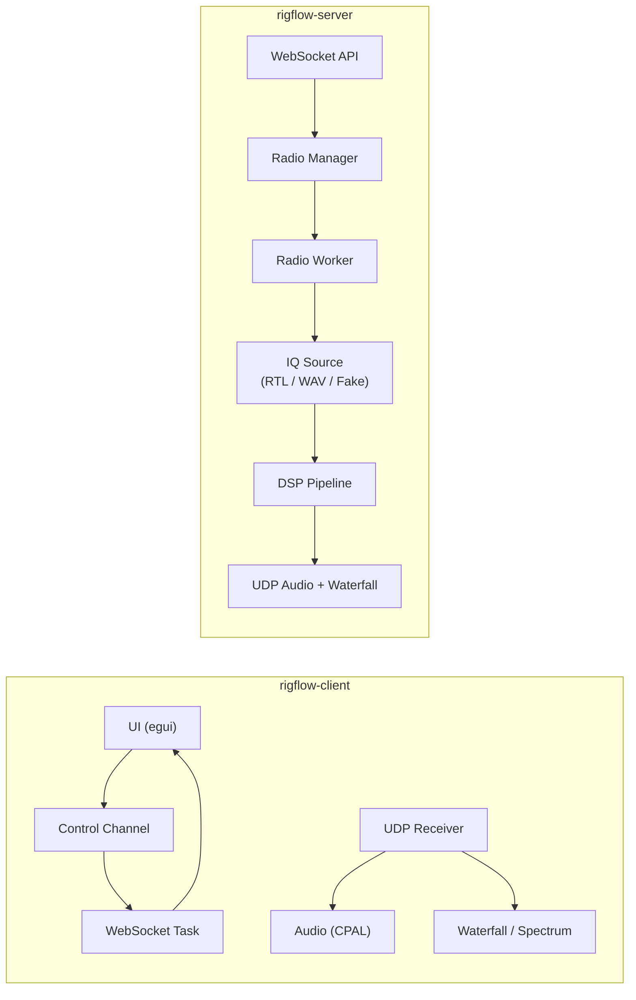
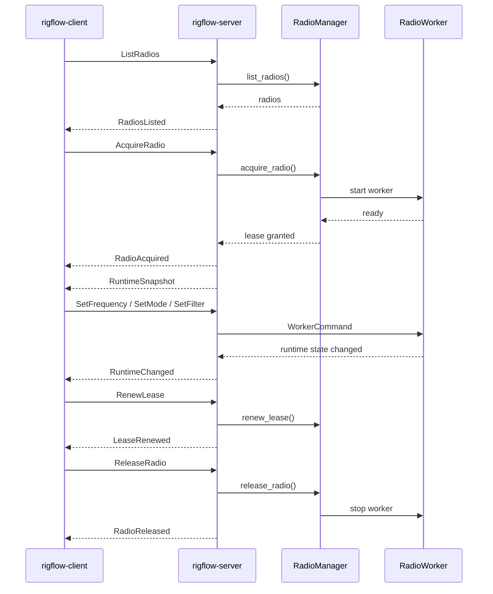

# rigflow

**rigflow** is a low-latency, client/server Software Defined Radio (SDR) system written in Rust.

It separates control, DSP, and UI to support remote operation, multi-radio setups, and clean extensibility.

---

## Crates

### rigflow-client
Desktop UI (egui)

- Connects via WebSocket
- Receives audio + waterfall over UDP
- Spectrum, tuning, demod, bookmarks, persistence

---

### rigflow-server
SDR backend

- Discovers radios (RTL-SDR, WAV, fake)
- Manages radio leasing (multi-client safe)
- Runs per-radio workers (source → DSP → UDP)
- Exposes control via WebSocket

---

### rigflow-core
Shared runtime + DSP

- Demodulation, filtering
- Audio + jitter buffer
- UDP framing
- Shared models

---

### rigflow-protocol
Wire protocol

- `ClientRadioMessage`
- `ServerRadioMessage`
- Typed, language-agnostic control layer

---

## Architecture

**Control Plane (WebSocket)**
- radio discovery, acquire/release
- tuning, mode, runtime updates

**Media Plane (UDP)**
- audio (48 kHz i16)
- waterfall/spectrum (FFT bins)

---

## Runtime Model

- radios discovered at startup
- client acquires a radio (lease)
- worker starts lazily per radio
- worker owns source + DSP + streaming
- worker shuts down on release/expiry

---

## Features

- multi-radio support
- low-latency audio
- real-time spectrum + waterfall
- demod modes: WFM, NFM, AM, USB, LSB, CW
- adaptive/manual waterfall control
- operator persistence + bookmarks
- extensible source control (sample rate, gain, PPM)

---

## Quick Start

```
cargo run -p rigflow-server -- --source rtlsdr
cargo run -p rigflow-client
```



## Protocol Flow


## rigflow-client

`rigflow-client` is the desktop UI for the rigflow SDR system.

It connects to a `rigflow-server` instance over WebSocket for control,
receives audio and waterfall data over UDP, and provides an interactive
UI for tuning, demodulation, and visualization.

### Responsibilities

- Connect to rigflow-server via WebSocket
- Acquire and control radios (frequency, mode, filters, etc.)
- Receive and play audio streams
- Render spectrum and waterfall displays
- Manage operator profiles and persistent settings

### Architecture

The client is composed of three main subsystems:

#### 1. UI (egui / eframe)

- Immediate-mode UI built with egui
- Renders spectrum, waterfall, and control panels
- Sends control commands via channel to the networking layer

#### 2. Control Plane (WebSocket)

- Runs in a dedicated Tokio runtime
- Sends `ClientRadioMessage` commands to the server
- Receives `ServerRadioMessage` updates (radio list, runtime state, etc.)

#### 3. Media Plane (UDP)

- Audio and waterfall data are received via UDP
- Audio is buffered and played via CPAL
- Waterfall and spectrum data are rendered in real time

### Runtime Flow

1. Load persisted UI/operator state
2. Start media runtime (audio + waterfall processing)
3. Start WebSocket control task (async)
4. Launch egui UI
5. UI interacts with server through control channel

### Networking

- WebSocket control:

  ```text
  ws://<server-ip>:9000/ws
  ```

- UDP media:

  - Client registers its UDP address with the server
  - Server streams:
    - audio (i16 samples)
    - waterfall/spectrum data (FFT bins)

### Persistence

The client stores per-operator settings, including:

- last server connection
- demodulation preferences (bandwidth, pitch, etc.)
- waterfall display settings (zoom, normalization)
- bookmarks (frequency presets)

Data is stored in a JSON file under the user config directory.

### Key Features

- Click-to-tune spectrum display
- Zoomable spectrum and waterfall
- Multiple demod modes (WFM, NFM, AM, USB, LSB, CW)
- Adaptive or manual waterfall normalization
- Bookmark system with default auto-apply
- Low-latency UDP audio streaming

### Example Usage

Start the server first:

```bash
cargo run -p rigflow-server -- --source rtlsdr
```

Then run the client:

```bash
cargo run -p rigflow-client
```

In the UI:

- Enter server IP
- Click Connect
- Select a radio
- Tune and operate

### Related Crates

- `rigflow-server` — SDR backend and DSP processing
- `rigflow-core` — shared DSP, audio, and utilities
- `rigflow-protocol` — shared WebSocket protocol types
## rigflow-server

`rigflow-server` is the backend service for the rigflow SDR system.

It discovers SDR sources, manages radio leases, runs per-radio worker
tasks, performs DSP processing, and exposes control/status over WebSocket.
Audio and waterfall/spectrum data are streamed to clients over UDP.

### Responsibilities

- Discover available radio sources
  - RTL-SDR hardware
  - WAV IQ files
  - fake/test signal source
- Manage radio acquisition and lease ownership
- Start radio workers lazily when a client acquires a radio
- Route control commands to the active worker
- Stream audio and waterfall data over UDP
- Publish runtime state over WebSocket

### Network Interfaces

- WebSocket control endpoint:

  ```text
  ws://<server-ip>:9000/ws
  ```

- UDP registration listener:

  ```text
  0.0.0.0:9001
  ```

Clients connect over WebSocket for control and lease management, then
provide UDP endpoints for audio and waterfall streaming.

### Protocol Model

The server uses the shared `rigflow-protocol` crate.

- Client → server:
  - `ClientRadioMessage`
  - examples: list radios, acquire radio, tune, change demod mode

- Server → client:
  - `ServerRadioMessage`
  - examples: radio list, lease updates, runtime snapshots, runtime deltas

`RuntimeSnapshot` is a full state sync.
`RuntimeChanged` is a sparse delta containing only changed fields.

### Runtime Model

The server uses a lazy worker model:

1. Radios are discovered at startup.
2. A client requests a radio lease.
3. The `RadioManager` starts or attaches to a worker for that radio.
4. The worker owns the source, DSP pipeline, and UDP streaming.
5. When the lease is released or expires, the worker is shut down.

### Example Usage

Start with the fake source:

```bash
cargo run -p rigflow-server -- --source fake
```

Start with RTL-SDR:

```bash
cargo run -p rigflow-server -- --source rtlsdr --rtl-device 0
```

Start with WAV IQ input:

```bash
cargo run -p rigflow-server -- --source wav --wav-file input_iq.wav
```

### Common Options

```
--source fake|wav|rtlsdr
--center HZ
--target HZ
--demod wfm|nfm|am|usb|lsb|cw

RTL-SDR:
--rtl-device INDEX
--rtl-sample-rate HZ
--rtl-gain TENTHS_DB
--rtl-auto-gain
--rtl-ppm PPM
--rtl-direct-sampling

WAV:
--wav-file PATH
--wav-dir PATH

Fake:
--fake-sample-rate HZ
--fake-tone HZ
```

### Related Crates

- `rigflow-client` — egui desktop client
- `rigflow-core` — shared DSP, radio, audio, and network utilities
- `rigflow-protocol` — shared WebSocket protocol types
